<h1 align="center">
  <a href="background">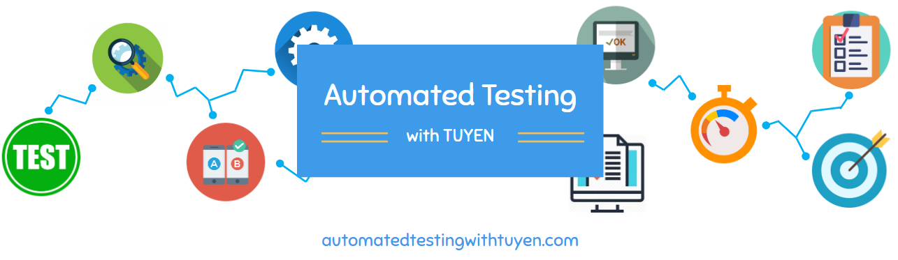</a>
  <a href="cover">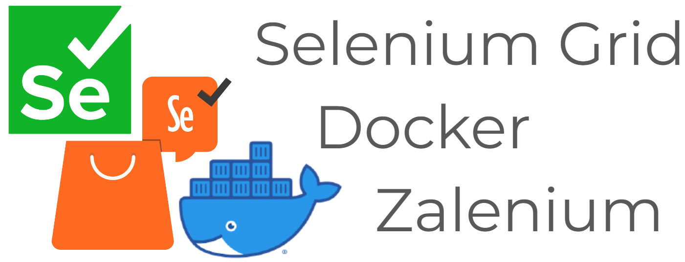</a>
</h1>

<h3 align="center" style="bold">A series of instruction about setting up selenium grid, docker and zalenium with TestNG framework.</h3>

# Table of Contents
- [Getting Started](#getting-started)
- [Set up Selenium Grid](#set-up-selenium-grid)
- [Set up Selenium Grid with standalone Docker image](#set-up-selenium-grid-with-standalone-docker-image)
- [Set up Selenium Grid with Docker image using different machines](#set-up-selenium-grid-with-docker-image-using-different-machines)
- [Set up Selenium Grid with Docker compose](#set-up-selenium-grid-with-docker-compose)
- [Set up Selenium Grid with Zalenium](#set-up-selenium-grid-with-zalenium)
- [Author](#author)
- [License](#license)

# Getting Started
## Selenium Grid
Selenium Grid allows the execution of WebDriver scripts on remote machines by routing commands sent by the client to remote browser instances.

Grid aims to:
- Provide an easy way to run tests in parallel on multiple machines
  - Allow testing on different browser versions
  - Enable cross-platform testing

In scope of this test, I only use Selenium Grid 4.

## Selenium Grid with Docker
Docker is an open-source containerization platform that makes it easy to create, deploy, and run applications in a secure manner using containers. Docker provides virtualization at the Operating System (OS) level. All the software parts in Docker are organized in Containers.

When it comes to Selenium automation testing, it is important that a test run in one execution environment does not hinder the execution of tests run in another test environment (s). Hence, automation tests should be run in isolation, and Docker helps in realizing this ‘essential’ requirement.
- Scalable and Reliable
- Less overhead of installations
- Improved Security
- Lesser chances of discrepancies

## Zalenium
Zalenium is a flexible and scalable container based Selenium Grid, with video recording, live preview, basic auth & a dashboard. Moreover, it has out-of-the-box Docker and Kubernetes integration. This fact makes Zalenium an attractive choice to get Selenium based infrastructure up and running.

Zalenium provides docker images (Hub + Nodes) with the latest browser drivers, browsers, and tools (for any language bindings) required for Selenium automation. The containers created from these images can be scaled-up with simple CLI commands.

# Set up Selenium Grid
## Prerequisites
- Java 11 or higher
- Browser(s) installed
- Download new Selenium Server jar: [latest release](https://github.com/SeleniumHQ/selenium/releases)

## Standalone mode
Standalone combines all Grid components seamlessly into one. Running a Grid in Standalone mode gives you a fully functional Grid with a single command, within a single process. Standalone can only run on a single machine.
- Start the Grid:
  ````bash
  java -jar selenium-server-<version>.jar standalone
  
  // We use 4.7.2
  java -jar selenium-server-4.7.2.jar standalone
  ````
- The server will start automatically at http://localhost:4444
- Point RemoteWebDriver in your test to http://localhost:4444
  ````bash
  ChromeOptions chromeOptions = new ChromeOptions();
  driver = new RemoteWebDriver(new URL("http://localhost:4444"), chromeOptions);
  ````
- Run your test
  - Example: /test/java/SeleniumGridTest.java
  - Execution file: SeleniumGrid.xml

<p align="center">
    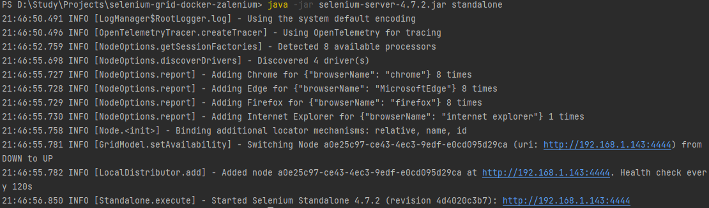
    <em>standalone run</em>
    <br>
    <br>
    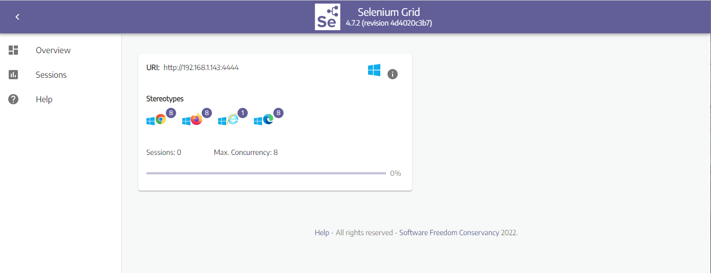
    <em>http://localhost:4444/ui</em>
</p>

## Hub and Node mode
Hub and Node is the most used role because it allows to:
- Combine different machines in a single Grid
  - Machines with different operating systems and/or browser versions, for example
- Have a single entry point to run WebDriver tests in different environments
- Scaling capacity up or down without tearing down the Grid

### Hub
To start a hub:
  ````bash
  java -jar selenium-server-<version>.jar hub
  ````
By default, the server will listen for RemoteWebDriver requests on http://localhost:4444

### Node
The command below assumes the Node is running on the same machine where the Hub is running:
  ````bash
  java -jar selenium-server-<version>.jar node
  ````

To set up more nodes on the same machine, we can specify different ports for them:
  ````bash
  // Node 1
  java -jar selenium-server-<version>.jar node --port 5555
  
  // Node 2
  java -jar selenium-server-<version>.jar node --port 6666
  ````
<p align="center">
    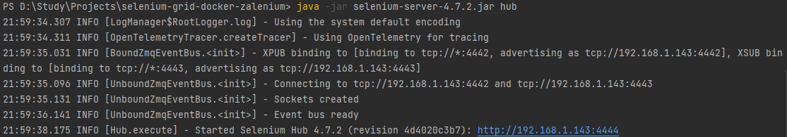
    <em>hub run</em>
    <br>
    <br>
    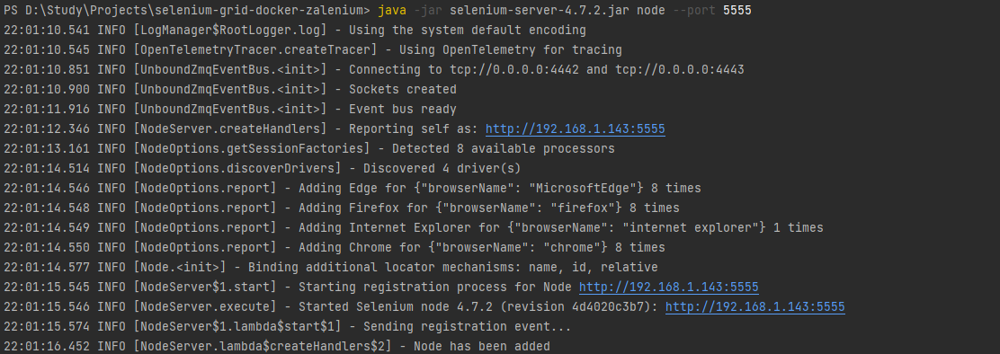
    <em>node 1 run</em>
    <br>
    <br>
    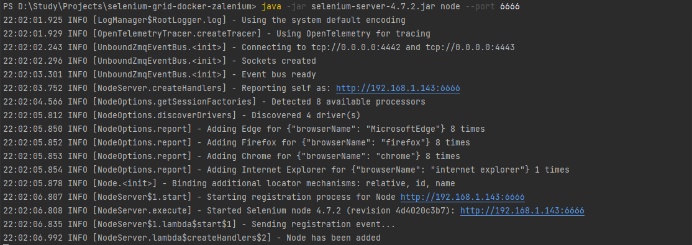
    <em>node 2 run</em>
    <br>
    <br>
    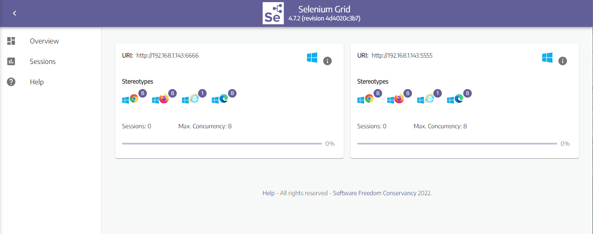
    <em>http://localhost:4444/ui</em>
</p>

### Point the test
- Point RemoteWebDriver in your test to http://localhost:4444
  ````bash
  case "chrome":
      ChromeOptions chromeOptions = new ChromeOptions();
      driver = new RemoteWebDriver(new URL("http://localhost:4444"),chromeOptions);
      break;
  case "firefox":
      FirefoxOptions firefoxOptions = new FirefoxOptions();
      driver = new RemoteWebDriver(new URL("http://localhost:4444"),firefoxOptions);
      break;
  ````
- Run your test
  - Example: /test/java/HubNodeTest.java
  - Execution file: HubNode.xml

### Hub and Node on different machines
Hub and Nodes talk to each other via HTTP and the Event Bus (the Event Bus lives inside the Hub). A Node sends a message to the Hub via the Event Bus to start the registration process. When the Hub receives the message, reaches out to the Node via HTTP to confirm its existence.

After starting the Hub with default ports, the --hub flag can be used to register the Node
  ````bash
  java -jar selenium-server-<version>.jar node --hub http://<hub-ip>:4444
  ````

When the Hub is not using the default ports, the --publish-events and --subscribe-events flags are needed.
For example, if the Hub uses ports 8886, 8887, and 8888
  ````bash
  java -jar selenium-server-<version>.jar hub --publish-events tcp://<hub-ip>:8886 --subscribe-events tcp://<hub-ip>:8887 --port 8888
  ````

The Node needs to use those ports to register successfully
  ````bash
  java -jar selenium-server-<version>.jar node --publish-events tcp://<hub-ip>:8886 --subscribe-events tcp://<hub-ip>:8887
  ````

## Distributed mode
When using a Distributed Grid, each component is started separately, and ideally on different machines.
So 6 of components below need to be started:
1. Event Bus
2. New Session Queue
3. Session Map
4. Distributor
5. Router
6. Nodes

The detailed instructions will be added later.

## Grid size suggestions
- Small: Standalone or Hub/Node with 5 or fewer Nodes.
- Middle: Hub/Node between 6 and 60 Nodes.
- Large: Hub/Node between 60 and 100 Nodes. Distributed with over 100 Nodes.

# Set up Selenium Grid with standalone Docker image
There are 3 docker images for Chrome, Firefox and Edge used in this example.

They will use port 4444 by default for server and 7900 for NoVNC, so to use all 3 without error in allocated ports, mapping new ports need to be done.

## Start Docker containers
### Start Chrome standalone with port 4445
  ````bash
  docker run -d -p 4445:4444 -p 7901:7900 --shm-size="2g" selenium/standalone-chrome:4.7.2-20221219
  ````
- Container exposed on port http://localhost:4445
- NoVNC (allow users inspect visually container activity with their browser) exposed on port 7901
- For an image that contains a browser please use the flag --shm-size=2g to use the host's shared memory
- In order to prevent pushing up to existing tags and breaking existing functionality, should use tagging convention
  ````bash
  selenium/standalone-browserName-<Major>.<Minor>.<Patch>-<YYYYMMDD>
  ````
- No need to pull image in advance as Docker will pull that image if it was not existed locally

### Start Firefox standalone with port 4446
  ````bash
  docker run -d -p 4446:4444 -p 7902:7900 --shm-size="2g" selenium/standalone-firefox:4.7.2-20221219
  ````
- Container exposed on port http://localhost:4446
- NoVNC exposed on port 7902

### Start Edge standalone with port 4447
  ````bash
  docker run -d -p 4447:4444 -p 7903:7900 --shm-size="2g" selenium/standalone-edge:4.7.2-20221219
  ````
- Container exposed on port http://localhost:4447
- NoVNC exposed on port 7903

## Point your test to exposed ports
In my test /test/java/DockerStandaloneTest.java
  ````bash
   case "chrome":
      ChromeOptions chromeOptions = new ChromeOptions();
      driver = new RemoteWebDriver(new URL("http://localhost:4445"),chromeOptions);
      break;
   case "firefox":
      FirefoxOptions firefoxOptions = new FirefoxOptions();
      driver = new RemoteWebDriver(new URL("http://localhost:4446"),firefoxOptions);
      break;
   case "edge":
      EdgeOptions edgeOptions = new EdgeOptions();
      driver = new RemoteWebDriver(new URL("http://localhost:4447"),edgeOptions);
      break;
  ````
Each url with respective port is set up with corresponding container.

<p align="center">
    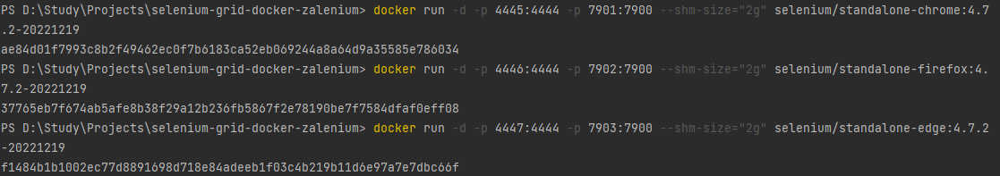
    <em>docker run</em>
    <br>
    <br>
    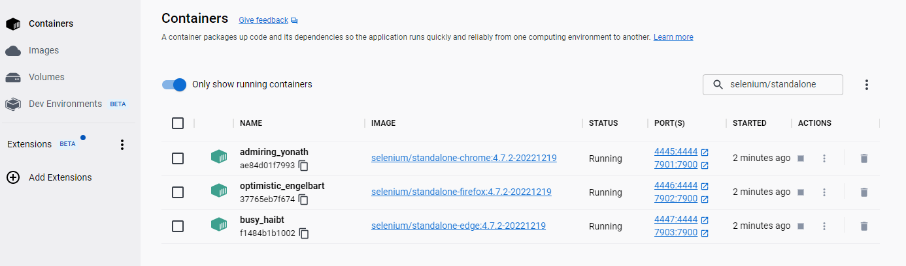
    <em>standalone containers</em>
    <br>
    <br>
    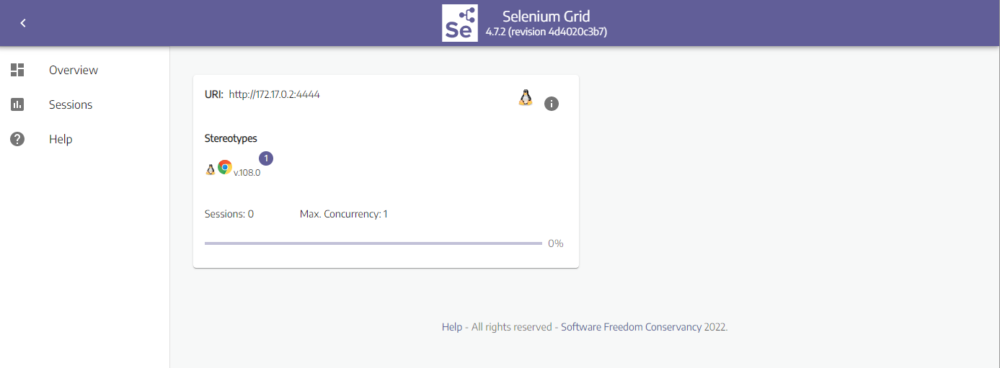
    <em>standalone chrome: http://localhost:4445/ui</em>
    <br>
    <br>
    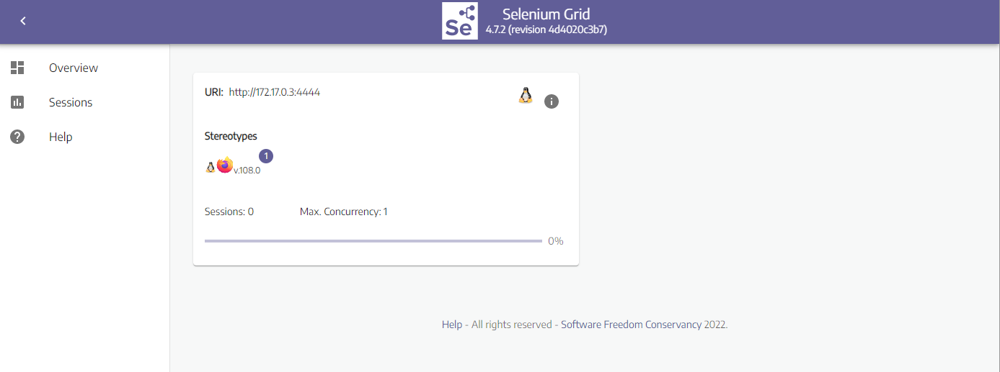
    <em>standalone firefox: http://localhost:4446/ui</em>
    <br>
    <br>
    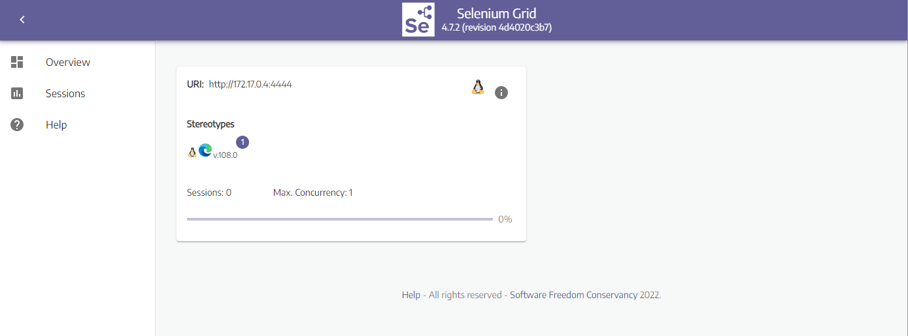
    <em>standalone edge: http://localhost:4447/ui</em>
</p>

## View test run visually on browser
New version of standalone container from selenium has provided noVNC to allow user to inspect what is running in browser.
We do not need to install VNC client to do this anymore.

To see what is happening inside the container, head to:
- Chrome container: http://localhost:7901/?autoconnect=1&resize=scale&password=secret
- Firefox container: http://localhost:7902/?autoconnect=1&resize=scale&password=secret
- Edge container: http://localhost:7903/?autoconnect=1&resize=scale&password=secret

or simply: http://localhost:7901 with password is "secret".
<p align="center">
    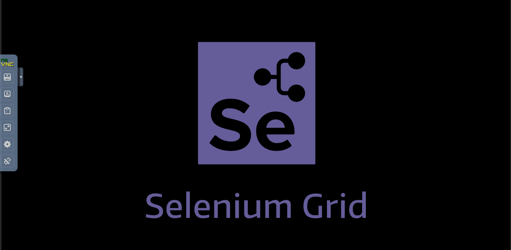
    <em>view tests run</em>
    <br>
    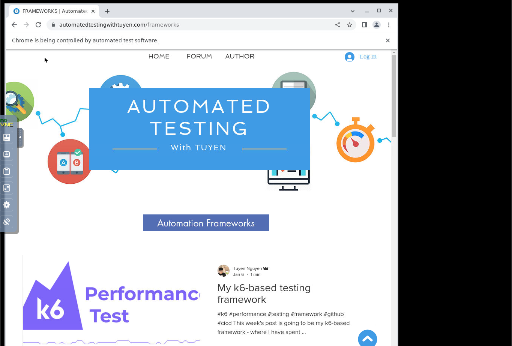
    <em>chrome: http://localhost:7901</em>
</p>

or clicking on video icon next to session id under Sessions tab.
<p align="center">
    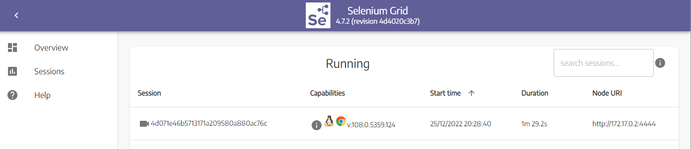
    <em>click video button to view</em>
</p>

# Set up Selenium Grid with Docker image using different machines
The Hub and Nodes will be created on different machines/VMs, they need to know each other's IPs to communicate properly. If more than one node will be running on the same Machine/VM, they must be configured to expose different ports.
And as I already mentioned, using different containers for hub and nodes, it is the same concept with setting up Hub and Nodes on different machines, which requires us to specify Event Bus, Publish Event port and Subscribe Event port.

## Hub - Machine/VM 1
By default, port 4444 is registered for server whereas 4442 and 4443 are exposed for Event Bus ports
  ````bash
  $ docker run -d -p 4442-4444:4442-4444 --name selenium-hub selenium/hub:4.7.2-20221219
  ````

## Node Chrome - Machine/VM 2
- Default port of Node is 5555, so we simply expose that
- Event Bus Host need to be set up with IP of Hub machine
- Node host is current IP of this Node machine
- Replace ^ with ` if you are using Linux/macOS/PowerShell, below example is for Windows CMD
  ````bash
    docker run -d -p 5555:5555 ^
      --shm-size="2g" ^
      -e SE_EVENT_BUS_HOST=<ip-from-machine-1> ^
      -e SE_EVENT_BUS_PUBLISH_PORT=4442 ^
      -e SE_EVENT_BUS_SUBSCRIBE_PORT=4443 ^
      -e SE_NODE_HOST=<ip-from-machine-2> ^
      selenium/node-chrome:4.7.2-20221219
  ````

## Node Firefox - Machine/VM 3
Same set up applied for Firefox node machine with few modifications about node ip and image
  ````bash
    docker run -d -p 5555:5555 ^
      --shm-size="2g" ^
      -e SE_EVENT_BUS_HOST=<ip-from-machine-1> ^
      -e SE_EVENT_BUS_PUBLISH_PORT=4442 ^
      -e SE_EVENT_BUS_SUBSCRIBE_PORT=4443 ^
      -e SE_NODE_HOST=<ip-from-machine-3> ^
      selenium/node-firefox:4.7.2-20221219
  ````

## Node Edge - Machine/VM 4
Same set up applied for Edge node machine with few modifications about node ip and image
  ````bash
    docker run -d -p 5555:5555 ^
      --shm-size="2g" ^
      -e SE_EVENT_BUS_HOST=<ip-from-machine-1> ^
      -e SE_EVENT_BUS_PUBLISH_PORT=4442 ^
      -e SE_EVENT_BUS_SUBSCRIBE_PORT=4443 ^
      -e SE_NODE_HOST=<ip-from-machine-4> ^
      selenium/node-edge:4.7.2-20221219
  ````

## Point test to exposed ip of hub
This just works seamlessly
  ````bash
  driver = new RemoteWebDriver(new URL("http://<ip-from-machine-1>:4444"),capabilities);
  ````

# Set up Selenium Grid with Docker compose

## What is Docker compose
Compose is a tool for defining and running multi-container Docker applications. With Compose, you use a YAML file to configure your application’s services. Then, with a single command, you create and start all the services from your configuration.

## docker-compose-v3.yml
  ```
  version: "3"
  services:
    chrome:
      image: selenium/node-chrome:4.7.2-20221219
      shm_size: 2gb
      depends_on:
        - selenium-hub
      environment:
        - SE_EVENT_BUS_HOST=selenium-hub
        - SE_EVENT_BUS_PUBLISH_PORT=4442
        - SE_EVENT_BUS_SUBSCRIBE_PORT=4443
  
    firefox:
      image: selenium/node-firefox:4.7.2-20221219
      shm_size: 2gb
      depends_on:
        - selenium-hub
      environment:
        - SE_EVENT_BUS_HOST=selenium-hub
        - SE_EVENT_BUS_PUBLISH_PORT=4442
        - SE_EVENT_BUS_SUBSCRIBE_PORT=4443
        
    edge:
      image: selenium/node-edge:4.7.2-20221219
      shm_size: 2gb
      depends_on:
        - selenium-hub
      environment:
        - SE_EVENT_BUS_HOST=selenium-hub
        - SE_EVENT_BUS_PUBLISH_PORT=4442
        - SE_EVENT_BUS_SUBSCRIBE_PORT=4443
  
    selenium-hub:
      image: selenium/hub:4.7.2-20221219
      container_name: selenium-hub
      ports:
        - "4442:4442"
        - "4443:4443"
        - "4444:4444"
  ```
- To execute this docker-compose yml file use 
  ````bash
  docker-compose -f docker-compose-v3.yml up
  ````
- Add the `-d` flag at the end for detached execution
  ````bash
  docker-compose -f docker-compose-v3.yml up -d
  ````
- To stop the execution, hit Ctrl+C, and then
  ````bash
  docker-compose -f docker-compose-v3.yml down
  ````
We can modify above yml to use noVNC by assign the default noVNC port of each node container (7900) to any port.

For example:
  ````bash
  chrome:
      image: selenium/node-chrome:4.7.2-20221219
      shm_size: 2gb
      depends_on:
        - selenium-hub
      environment:
        - SE_EVENT_BUS_HOST=selenium-hub
        - SE_EVENT_BUS_PUBLISH_PORT=4442
        - SE_EVENT_BUS_SUBSCRIBE_PORT=4443
      ports:
        - "7901:7900"
  ````
Then we can inspect what runs inside browser of container by" http://localhost:7901/?autoconnect=1&resize=scale&password=secret

Or we can see that easily by clicking on video icon under Sessions tab.

Go to "View test run visually on browser" for more details.

## Point test to exposed hub port
An example test is in /test/java/DockerComposeTest.java
  ````bash
  driver = new RemoteWebDriver(new URL("http://localhost:4444"),chromeOptions);
  ````
Run it with DockerCompose.xml execution file

<p align="center">
    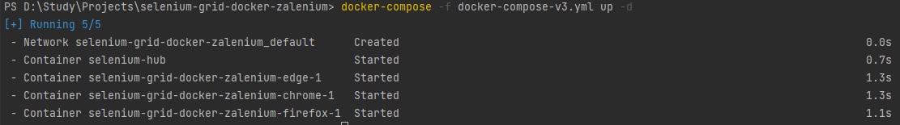
    <em>compose run</em>
    <br>
    <br>
    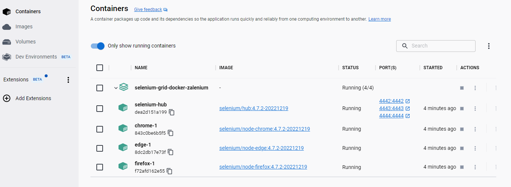
    <em>compose containers</em>
    <br>
    <br>
    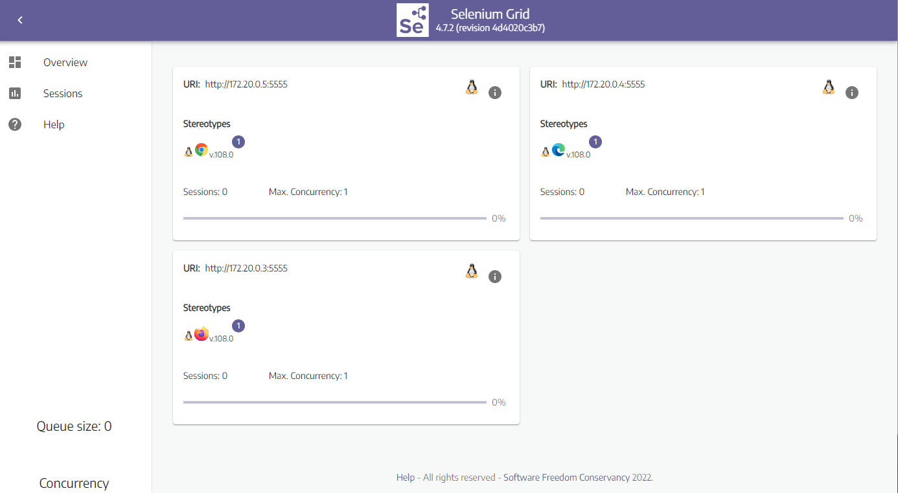
    <em>http://localhost:4444/ui</em>
</p>

## Video recording for test execution
Tests execution can be recorded by using the selenium/video:ffmpeg-4.3.1-20221219 Docker image. One container is needed per each container where a browser is running. This means if you are running 5 Nodes/Standalone containers, you will need 5 video containers, the mapping is 1-1.

Currently, the only way to do this mapping is manually (either starting the containers manually, or through docker-compose)

After the containers are stopped and removed, you should see a video file on your machine's /tmp/videos directory.

Please head to docker-compose-v3-video.yml for full details.

# Set up Selenium Grid with Zalenium
Zalenium is not being developed anymore, so it has been stick to Grid 3.x which not inherited the best features from Grid 4.

But it still has its own great features including (Grid 4 has them as well):
- An intuitive dashboard for analyzing the logs of the Selenium script execution.
- Live previews of the Selenium script execution on Selenium Grid.
- Custom capabilities for running cross-browser tests and responsive tests on preferred screen resolutions and time-zones.
- The recorded video of the Selenium tests helps in the review and debug process.
- Zalenium Grid on the cloud comes with basic authentication, thereby providing basic security when accessing the Grid.

So if you find this is still good for your needs, here is how you can set it up.

## Start the image
Zalenium uses docker to scale on-demand, therefore we need to give it the docker.sock full access, this is known as "Docker alongside docker".

To explicitly pulling elgalu/selenium images without separate command, we can use "-e PULL_SELENIUM_IMAGE=true"

Replace ^ with ` if you are using Linux/macOS/PowerShell, below example is for Windows CMD

  ````bash
  docker run --rm -ti --name zalenium -p 4444:4444 ^
    -e PULL_SELENIUM_IMAGE=true ^
    -v /var/run/docker.sock:/var/run/docker.sock ^
    -v /tmp/videos:/home/seluser/videos ^
    --privileged dosel/zalenium start
  ````
Run Zalenium as --privileged is suggested to speed up the node registration process by increasing the entropy level. This is optional since it is just meant to improve its performance.

By default, our Selenium grid will have 1 Chrome and 1 Firefox container. If you need more, say 3 chrome containers, 2 firefox then use below arguments.
  ````bash
  docker run --rm -ti --name zalenium -p 4444:4444 ^
    -e PULL_SELENIUM_IMAGE=true ^
    -v /var/run/docker.sock:/var/run/docker.sock ^
    -v /tmp/videos:/home/seluser/videos ^
    --privileged dosel/zalenium start --chromeContainers 3 --firefoxContainers 2
  ````

## Point your test
Point the test to http://localhost:4444/wd/hub

And we can access below:
- Grid console: http://localhost:4444/grid/console
- Zalenium Live Preview: http://localhost:4444/grid/admin/live
- Dashboard: http://localhost:4444/dashboard/ after running your first test

To stop: 
  ````bash
  docker stop zalenium
  ````
For more usage, go here: https://opensource.zalando.com/zalenium/#usage

# Author
<h4 align="center">
	Tuyen Nguyen - Senior QA Automation Engineer
	</h4>
	<h5 align="center">
	<a href="trongtuyen96@gmail.com">trongtuyen96@gmail.com</a>
	</h5>
<p align="center">
  <a href="https://github.com/trongtuyen96">
    </a>
  <a href="https://www.linkedin.com/in/tuyennguyen96/">
    </a>
  <a href="https://www.facebook.com/ntrongtuyen96">
    </a>
</p>

# License
~~~~
Copyright 2022 Tuyen Nguyen

   Licensed under the Apache License, Version 2.0 (the "License");
   you may not use this file except in compliance with the License.
   You may obtain a copy of the License at

       http://www.apache.org/licenses/LICENSE-2.0

   Unless required by applicable law or agreed to in writing, software
   distributed under the License is distributed on an "AS IS" BASIS,
   WITHOUT WARRANTIES OR CONDITIONS OF ANY KIND, either express or implied.
   See the License for the specific language governing permissions and
   limitations under the License.
~~~~
